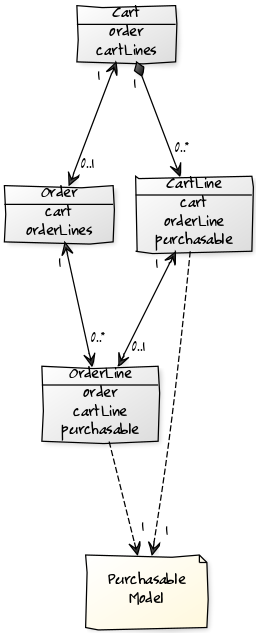
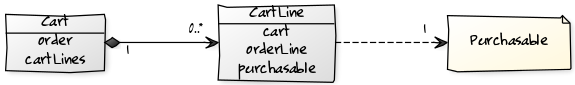

# Cart Architecture

This is one of the most important parts of the whole project. How Elcodi's cart
works? How it's been designed? And how can I deal with it?

We will show you how we have designed all the model and why have we decided this
architecture. It is important for you to understand the design in order to
detect all possible entry and modification points, to make the Cart component as
much customized as you need.

## Introduction

Let's start by determining what the Cart Component should take care about. Well,
not difficult at all, so we are working in an E-commerce. The component itself
takes care about all related to the Cart and the Order. The component provides
you a complete service layer for you application, so knowing and understanding
this layer will help you a lot in your own implementation.

We will split all the model in two parts, the Cart path and the Order part. Both
parts are connected but they can (and should) be treated in a very isolated way.



First of all, forget about the Purchasable instance. This is just the way we
will refer to the concept of Product (please, read the 
[Product Architecture](product-architecture.md) chapter in order to know more
about it. Let's focus on how the Cart and Order are built.

## Cart

The bucket itself. Every customer has it's own cart, and it's life is connected
to the session and to the customer as well. This means that even if you change
the device, and as long as you're logged in, then you will be able to retrieve
the cart from the database.

Some parts of the cart are not stored in database, like the prices. Because of
some products from your cart can be disabled between page views, or because
their prices can be modified as well, every time you request your cart, prices
are reloaded and saved locally, in your object life. Of course, this means two
things:

* Your cart loading consumes some resources in each request
* You cannot lookup in your database by these values

Anyway, this strategy helps a lot in your stored carts status. This means that
you will not store invalid prices.

The Cart model introduces a new object called Cart Line.

## Cart Line

Everytime a new purchasable object is added into a Cart, you must save, at
least, one extra information about this relation (cart and purchasable): the
quantity. Because of this, you cannot relate directly both elements. Of course,
if the purchasable object needs more information about the relation, for example
color, size or any single text, you should save them all as well.

For this, we will work with an extra man-in-the-middle class called CartLine. In
this class we'll save the Cart, the purchasable object and all this information.
CartLine is designed using
[Object Composition](https://en.wikipedia.org/wiki/Object_composition). It means
that the life of all CartLine instances are coupled to the life of the Cart
instance.



## Loading the cart

As we said, the cart is loaded each time, but, who loads it? In fact, and
because of our service layer, you will find that loading cart is as easy as
using an event dispatcher called `elcodi.event_dispatcher.cart`.

``` php
$cart = $this
    ->cartRepository
    ->find(1);
    
$this
    ->cartEventDispatcher
    ->dispatchCartLoadEvents($cart);
```

Let's check as well how to inject the event listener. In that case we are
injecting both the event dispatcher and the cart repository, for cart
retrieving.

``` yaml
services:
    my_cart_loader:
        class: My\Cart\Loader\Class
        arguments:
            - @elcodi.repository.cart
            - @elcodi.event_dispatcher.cart
```

After that call, your cart will be completely loaded, including prices and
checks, and invalid cart lines will be safely removed. Of course, and because
the project uses a strong event layer, some events will be dispatched during the
process.

* [cart.preload](events.md#cartpreload)
* [cart.onload](events.md#cartonload)
* [cart.inconsistent](events.md#cartinconsistent)

The question then is... how can I know that a cart has been loaded? Well, easy
indeed.

``` php
$cart = $this
    ->cartRepository
    ->find(1);
    
$isLoaded = $cart->isLoaded();
// $isLoaded === false
    
$this
    ->cartEventDispatcher
    ->dispatchCartLoadEvents($cart);
    
$isLoaded = $cart->isLoaded();
// $isLoaded === true
```

## Cart transformation

Once the cart must be converted to an order, there is a nice transformer for
that occasion. Let's see an example of that transformation. In that occasion, we
assume that `getLoadedCart()` returns an already loaded cart.

``` php
$cart = $this->getLoadedCart();

$order = $this
    ->cartOrderTransformer
    ->createOrderFromCart($cart);
```

This action produces as well some new events.

* [order.precreated](events.md#orderprecreated)
* [order.oncreated](events.md#orderoncreated)
* [order_line.oncreated](events.md#orderlineoncreated)

After this action, the cart becomes ordered

``` php
$cart = $this->getLoadedCart();

$order = $this
    ->cartOrderTransformer
    ->createOrderFromCart($cart);
    
$cartIsOrdered = $cart->isOrdered();
// $cartIsOrdered === true
```

## Order

The order should always be a plain copy of a cart. Of course, and because the
object's behaviour should be as immutable as possible, all prices are calculated
and saved in database.


Inside the entity, you will find this information:

* Cart where the order belongs
* Dimensions of the order (only physical orders)
* OrderLines, each one as a mirror of each CartLine
* Quantity of the order, total number of elements
* Prices from products, coupons, shipping and total.
* Addresses from delivering and billing
* Order States

## Order states

When an order is created, each instance can travel through an amount of
predefined states.

With the basic implementation, you will find defined state machines for payment
and shipping. To know more about this, please, read the [Payments](payments.md)
and the [Shipping](shipping.md) chapters