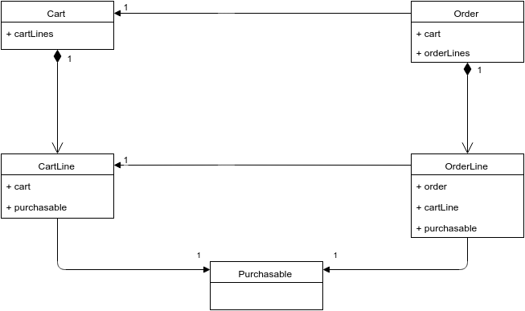

# Cart Architecture

This is one of the most important parts of the whole project. How Elcodi's cart
works? How it's been designed? And how can I deal with it?

We will show you how we have designed all the model and why have we decided this
architecture. It is important for you to understand the design in order to
detect all possible entry and modification points, to make the Cart component as
much customized as you need.

## Introduction

Let's start by determining what the Cart Component should take care about. Well,
not difficult at all, so we are working in an E-commerce. The component itself
takes care about all related to the Cart and the Order. The component provides
you a complete service layer for you application, so knowing and understanding
this layer will help you a lot :)

We will split all the model in two parts, the Cart path and the Order part. Both
parts are connected but can  (and should) be treated in a very isolated way.

First of all, forget about the Purchasable instance. This is just the way we
will refer to the concept of Product (please, read the 
[Product Architecture](product-architecture.md) chapter in order to know more
about it. Let's focus on how the Cart and Order are built.
