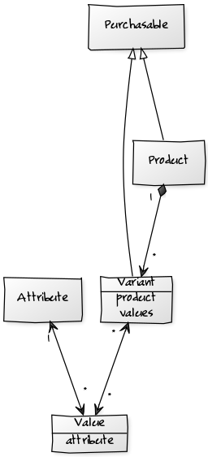

# Product Architecture

One of the main blocks in Elcodi is it's Product architecture. We assume that
all projects will need to handle with it's own Product model diagram, so we
propose a single one, based on the most basic scenario and with an architecture
where you will be able to modify the model as much as you need.



## Purchasable

Because you should be able to add anything both a product or a variant in your
cart, we created the interface `Purchasable`. A purchasable is an object (any)
you can add into your cart.

In Elcodi we have implemented two completed classes implementing this interface:
Product and Variant. Both implementations are part of the Product component, and
composes all the needed structure to maintain all kind of products and
variations of this.

## Product

The main entity of this component. A product is what you are going to sell, no
matter what it is and not taking in account variations of this. For example, our
product could be a simple T-shirt. No color, no size, just a simple T-shirt.

Each product contains all information related to that element, like price, some
dimensions (all of them optional, of course), a description and a name, a SKU,
the stock of that object, and some extra properties. All you need to make this 
element unique enough.

You can create a new Product like this.

``` php
use Elcodi\Component\Product\Entity\Product;

$product = new Product();
$product
    ->setSku('123456789')
    ->setStock(4)
    ->setName('Strawberry cake')
    ->setDescription('This is a strawberry cake');
```

Of course, the right way in Elcodi is always using factories instead of creating
new instances by hand.

``` php
$product = $this
    ->productFactory
    ->create()
    ->setName('Strawberry cake')
    ->setDescription('This is a strawberry cake');
```

This service should have this dependency injection definition

``` yaml
services:
    my_service:
        class: My\Service\Namespace
        arguments:
            - @elcodi.factory.product
```

Some times our E-commerce implementation only requires this infrastructure. If
you sell for example single cakes, then each cake is a product, and that should
be enough. Don't over-engineer your domain and project too much.

In other cases, for example if your e-commerce is selling some retail, then each
Product will have some variations. Let's see what a variation is and how we can
implement it in Elcodi.

## Variant

A Variant is a simple variation of a Product. Returning to the example of
T-shirts, maybe you want to sell the same T-shirt in several colors, several
sizes and several logos behind it.

One option is having one single product per each combination, and that would be
a good approach indeed, but then you have no way of controlling all products
that belong to the same family. For example, if all variations have the same
price then you should add it several times in several instances. As soon as this
price changes, then you need to change it all around.

Bad choice, right?

If you have only one Product called T-shirt and you create the right structure
for maintaining some Attributes and some Values, then you can create several
Variants, each one containing one or more Values. Because a Variant is a
Purchasable as well, then you can add them as well in your Cart.

First of all, let's see how to create a variant, assuming we have the previous
product created.

``` php
use Elcodi\Component\Product\Entity\Product;
use Elcodi\Component\Product\Entity\Variant;

$product = new Product();
$product
    ->setName('T-shirt, Dora the explorer')
    ->setDescription('T-shirt of Dora');
    
$variant = new Variant
$variant
    ->setSku('12341234')
    ->setStock(10)
    ->setName('Blue XL T-shirt with the logo')
    ->setProduct($product);
```

Of course, the right way in Elcodi is always using factories instead of creating
new instances by hand.

``` php
$product = $this
    ->productFactory
    ->create()
    ->setName('T-shirt, Dora the explorer')
    ->setDescription('T-shirt of Dora');
    
$variant = $this
    ->variantFactory
    ->create()
    ->setSku('12341234')
    ->setStock(10)
    ->setName('Blue XL T-shirt with the logo')
    ->setProduct($product);
```

This service should have this dependency injection definition

``` yaml
services:
    my_service:
        class: My\Service\Namespace
        arguments:
            - @elcodi.factory.product
            - @elcodi.factory.variant
```

In fact, that code is not useful at all, so none of these variants have
attributes. Next step, creating a map of configurations for these Variants.

## Attributes

A variant is composed by different attribute values. Let's check it out by using
the last example. T-shirt of Dora the explorer is available in colors blue, red
and green. Each one can be purchased in several sizes: S, M and L.

Each Variant is a Product and one of each attribute, called Value. So, there is
one Variant that will have internally the Value blue of the Attribute color, and
the Value S of the Attribute Size.

Assuming the piece of code we did before about product and variant...

``` php
$product = //;
$variant = //;

$attribute = $this
    ->attributeFactory
    ->create()
    ->setName('size');
    
$value = $this
    ->valueFactory
    ->create()
    ->setValue('S')
    ->setAttribute($attribute);

$variant->setValue($value);
```

As you can see, the relation is done between the Attribute and the Value, but
because one Value can only have one Attribute, then the relation is done as well
between the Variant and the Attribute.

``` php
$attribute = $variant
    ->getValue()
    ->getAttribute();
```

## Manufacturer

A product (and because a Product is always the master piece of any purchasable)
can have a manufacturer. The relation is easy and simple indeed, so there is no
much need of explaining how to work with this entity.

``` php
$product = //;

$manufacturer = $this
    ->manufacturerFactory
    ->create()
    ->setName('Levis');
    
$product->setManufacturer($manufacturer);
```

## Categories

There is an entire chapter for that in Elcodi's book. Please, read it carefully
in order to be able to work properly with categories in your project

* [Category Architecture](http://elcodi.io/docs/book/category-architecture/)
